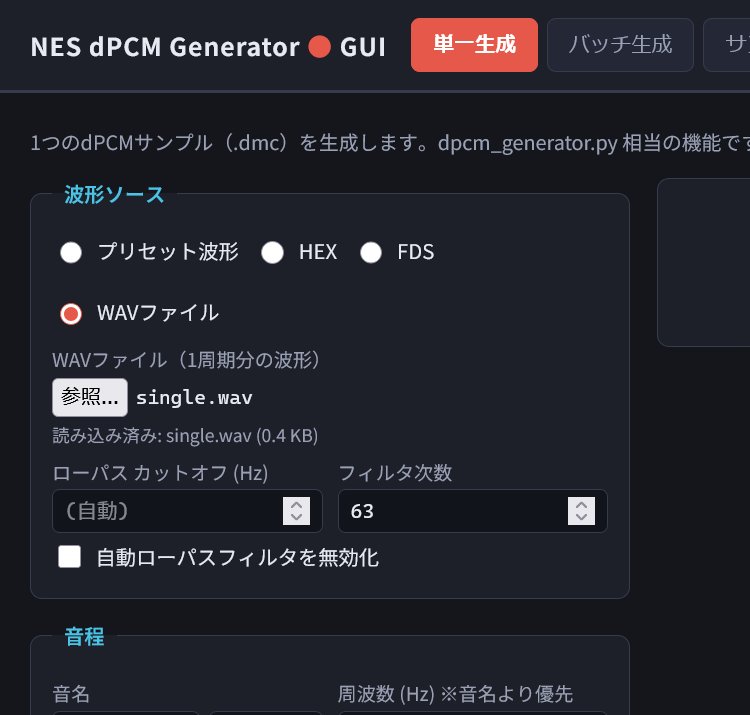
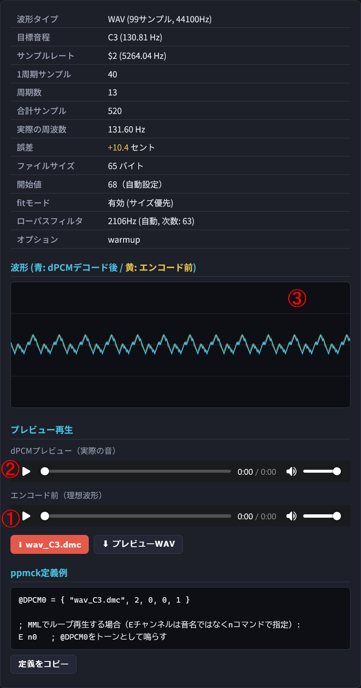
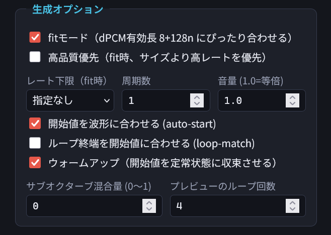
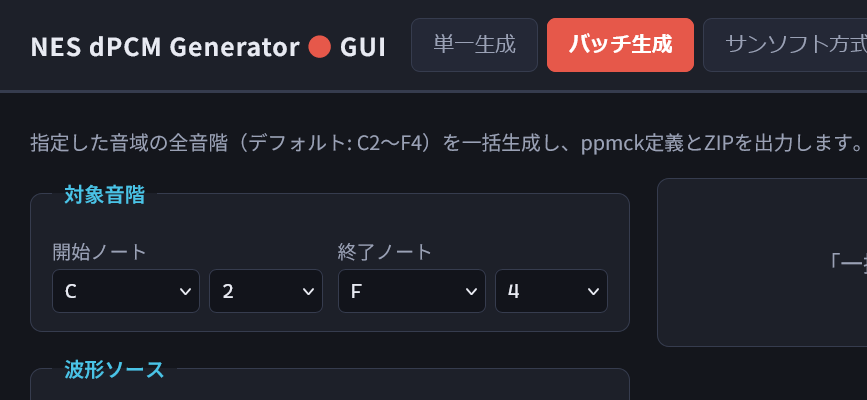
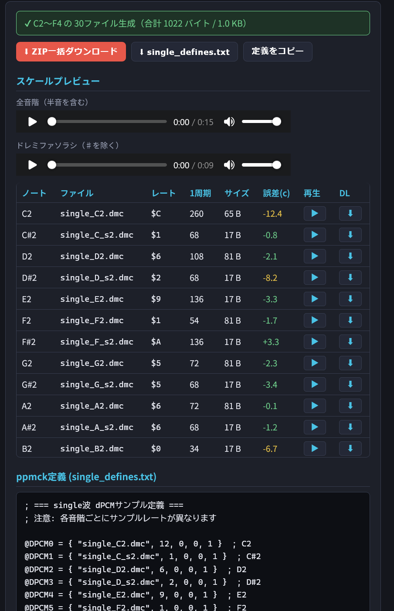
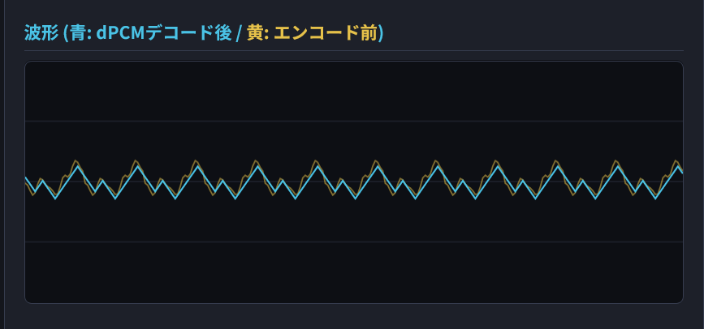
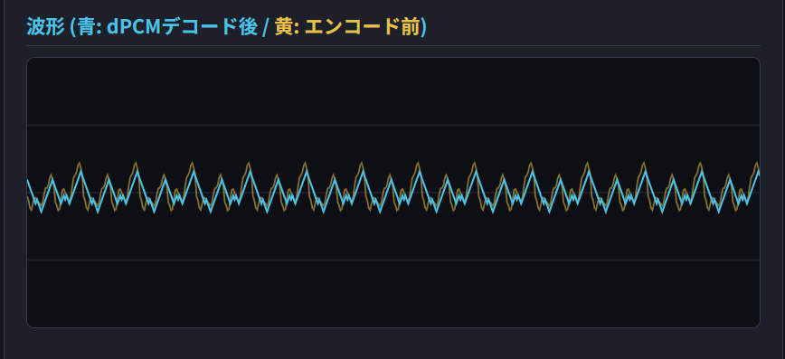
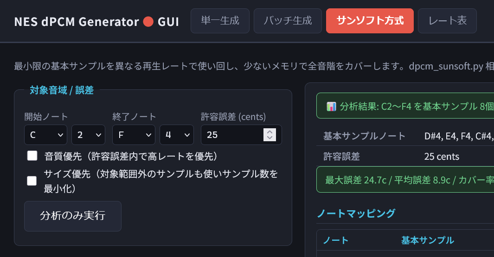
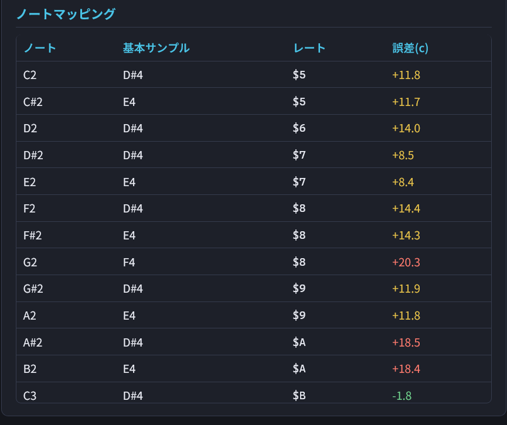
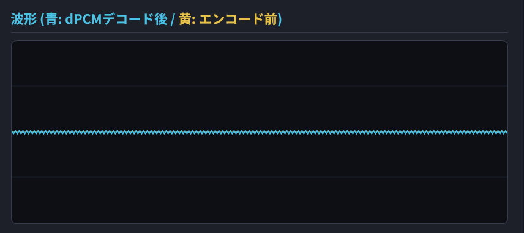

# このツール(dPCM Tone Generator)について


## 3行まとめ

- ファミコンのdPCMチャンネルで **途切れることのない長い音（トーン音）** を鳴らせるようになります
- **ループ再生しても波形が断裂しないdPCMファイル**を数学的に求めて作成します
- dPCMベースの要領で音階を作れるので、**拡張音源抜きで** *任意の波形の* PCM音源チャンネル／波形メモリ音源チャンネルを追加できます

実際の効果を手っ取り早く知りたい方は、[サンプル楽曲](#サンプル楽曲)の項を見てください。


## 従来型dPCMの限界

ファミコン音源において、**dPCMチャンネル**（デルタPCM, DPCM）と呼ばれる**録音した音を再生する機構**が曲や演出のアクセントとして用いられていることがよくあります。
有名どころだと、たとえば『スーパーマリオブラザーズ3』での『タタタタンッ』と鳴るドラムや、飛行船ステージ開始時の『ボォンボォン』と鳴る重低音打楽器の音などですね。

一方、いわゆる **dPCMベース（Sunsoftベース）** のようにdPCMサンプルを使って**音階を表現するPCM音源的な演奏方法**のテクニックは、ファミコン音源愛好家の間ではよく知られています。
特に有名な例としては『ギミック！』のベースライン（Sunsoftベースの由来）や『暴れん坊天狗』の一面曲（Tengurila）でのベースラインなどが挙げられるでしょうか。

しかしこれらの例でも、音階つきの楽器音として使われているのは**短音**であり、いわば「**ドラム音に音階をつけたようなもの**」という域からの脱却は果たせていません（もちろん、それでも強力な表現方法なのですが）。
先ほどの『ギミック！』の例ではdPCMはスラップベースのアタック部分として、『スーパー魂斗羅』ではオーケストラヒットとして……などの使用方法が『限界』でした。

これらの『限界』は、ファミコンdPCMが抱えていた技術的な制約（仕様）によって生じています。

## 夢の『ファミコン版PCM音源』？

スーパーファミコンなどで採用された**PCM音源**では、任意の短い波形（しばしば一波形ぶん）を録音し、それを連続再生して音色として使用することで高い表現力を得ていました。
有り体に言えば、**用意しておいた一波形ぶんの波形のサンプルを、発音したい音長分だけ無限ループして出力する**ことで、任意の音色を持った楽器を再現できる……という仕組みになっています（※）。
もちろんこれだけでは常に同じ高さの音しか出ないので、**再生速度を変化させる＝周波数を変化させる**ことで音程を変えて楽器として成立させていたわけですね。

（※これは正確には「波形メモリ音源」の説明になるかもなのですが、ひとまずここではPCM音源としておきます）

ファミコンで採用されているdPCMというのは、このPCM（スーファミではADPCM）の前駆的な機能であり、原理的には **dPCMを使ったPCM音源（dPCM音源？）** というものだって考えることはできそうです。
そのためにまず必要なのは、dPCMを無限ループして再生する機能でしょうか。

実はあまり知られていませんが、ファミコンのdPCMチャンネルではネイティブで**ループ再生に対応**しています。有名作品では「パンチアウト!!」での客席ガヤなどで実際の用例を見る（聴く）ことができます……が、他にこのループ機能を有効に使っている例はあまりないように思います。

一体なぜでしょうか？
ループ再生機能もあって、波形をサンプルすることもできて。それなのに、なぜ夢の『ファミコン版PCM音源』が実際に採用されることはなかったのでしょう？
それは、ファミコンのdPCMには**所定のサイズであること**と、**所定の再生速度であること**という２つの仕様上の制約があったためです。

所定の再生速度、というのはどういうことかというと……
先ほどの「一波形ぶんの波形のサンプル」という例で考えるなら、これを**再生できる速度に縛りがある**ぞ、ということになります。
再生速度を変えるのは音程を変えることとイコールなので、つまり、**自由な音程で出力できなくなる**ぞ、という意味ですね。
それだけならばまだしも、ファミコンdPCMではこの「再生速度」は、音楽的な意味での音階と直接は連動していません。下手すればドレミ……の音階にはなっていない中途半端な音程の音が出てしまうわけですね。

いやいやそれは困る。なんとかならないか……そうだ。
繰り返すべき、**元の「一波形ぶんの波形のサンプル」を最初から何種類か用意しておく**というアイデアはどうでしょうか。
ドレミ……の音階分だけ事前にサンプルを用意しておいて、あとは音階ごとに無限ループして出力さえすればよいのです。
ちょっぴりデータ容量を浪費しますが、これならばうまくいくようにも思えますね。

しかし……dPCMにはもうひとつ、所定のサイズであることという強烈な制約があるのでした。
要するにコレは、事前に用意できる **「一波形ぶんの波形のサンプル」すら自由に選択できない** ということを意味しています。
ここでいうサイズというのはサンプル数、つまり「波形の長さ＝波長」と同じ意味になりますので、**波長を自由に取れないなら音程も自由に取れない**ということになってしまいます。

やはり、ファミコンで正攻法のPCM音源を作るのは無理なのです。

## このツールがやれること

では、正攻法をやめれば可能性はあるのでしょうか？　そう、**裏技**があります。
それがこのツールの実現する手法であり、これを使うことで**ファミコンによる疑似PCM音源チャンネル**が爆誕します。

考え方は気づけば単純です。
**ひとつの波形で無理ならば、複数の波形で成立させればよいのです**。
ある波形に対し、それを複数個並べてぴったりdPCMの制約を満たす繰り返し数、サンプル数、再生速度を数学的に求め、一番その条件に近い状態のdPCMを生成、出力するというのがこのツールの原理です。

……詳しい原理はともかく、まずはやってみましょう。
**必要なのは任意の楽器／音色から切り出した一波形ぶんのwavファイルだけ**です。
これは自分で用意してもよいですし、一般的なサンプラー向けに Single-Cycle-Waveforms として配布されていることもあります。

今回はサンプルとして同梱している `single.wav` を使用しましょう。
このファイルを「参照」から選択（または参照ボタン上にファイルをドラッグ）し……



他はデフォルト設定のまま、最下部の「**生成する**」を押します。
すると、この波形を使って鳴らした『ファミコンPCM音源』のド（C3）の音を鳴らせるdPCMファイルと、ppmck向けの音源定義が出力されます。



まず、**①**をクリックしてみてください。これが最初に用意した single.wav を無限ループさせて鳴らした音になります。
**②**が、それをdPCMに変換して同じく無限ループさせて鳴らした音になります。
dPCMの変換精度の関係で完全に元の音を再現できるわけではないですが、**ある程度近い音**が鳴っていることを確認できるはずです。

この「ある程度近い音」がどれくらい近い音なのかは、**③**の波形の状況を見ることでも確認ができますね。
この部分では同じ形の波形が何個も並んでループしているということもわかると思います。
これが、本提案手法の肝である**複数波形によりファミコンdPCMの定める所定のサンプル数と波形サンプル数の『最小公倍数』的な最適解を求める**という仕組みを端的に表現しています。

……まぁこれも細かい説明は省きますが、**よりよい音を求めるとより大きなdPCMファイルサイズになる**ということだけは覚えておいてください。
なお、その精度については生成オプションの部分で「**高品質優先**」のチェックボックスを入れることなどで調整ができます。




## 波形メモリ音源ぽく使う

先ほど「一波形ぶんを繰り返し使う」という説明をしたときに、これはむしろ「**波形メモリ音源**」の特徴である……と補足を入れました。
PCM音源と波形メモリ音源の違いについてここでは深堀りしませんが、dPCMを使用して波形メモリ音源的な挙動を再現することもある程度は可能です。

さしあたり、本ツールでは**FDS音源**（ファミコンディスクシステム）および**GB音源**（ゲームボーイ）で使用されているような波形定義を流用できる機能を実装しています。
なお、お察しかと思いますが、これは内蔵音源しか使えない**NES**で上記の音源を再現して音の厚みを出すために非常に有力な手段となります。

たとえば、こちらはFDS音源の波形定義データです。

````txt
00 02 20 39 52 57 52 46 43 48 54 63 63 57 51 43
35 35 32 30 55 29 26 32 36 45 45 46 43 45 45 46
48 46 45 45 43 46 45 45 36 32 26 29 55 30 32 35
35 43 51 57 63 63 54 48 43 46 52 57 52 39 20 02
````

※「謎の村雨城 三味線」の波形定義。[mck wiki 波形定義](https://wikiwiki.jp/mck/%E6%B3%A2%E5%BD%A2%E5%AE%9A%E7%BE%A9)より引用

これを使うと、このような波形が出来上がります。
音はこんな感じです。

留意すべき点としては、これは厳密に波形定義をなぞるものではありません。
あくまでも「FDS音源で鳴らした音(wav)に対して**dPCMで近似する**」という仕組みになっています。

（説明書きかけ）


## 自分の曲で使う

ここまでで「何ができるか」について説明してきましたが、肝心な「じゃあどう曲作りに活かすのか」の説明がまだでした。
これについては、右下の領域にあるものが気になっていた方々もいらっしゃるでしょう。
「**ppmck定義例**」というやつですね。

````mml
@DPCM0 = { "wav_C3.dmc", 2, 0, 0, 1 }

; MMLでループ再生する場合（Eチャンネルは音名ではなくnコマンドで指定）:
E n0   ; @DPCM0をトーンとして鳴らす
````

`wav_C3.dmc` をダウンロードしたうえで所定のフォルダに配置し（※パス指定に注意）て、上記の内容をコピペの上でppmckでコンパイル、nsfを再生してみてください。
上手く行っていれば、何かしらの音が鳴るはずです。
特に上手く行っているなら、この音が C3 の音で鳴っていることもわかるでしょう。
これを**必要な音階分だけ繰り返せば**、あなたの楽曲にはdPCMトーン音源による新たな彩りが加わることでしょう。

……いや待て、**そんな面倒なこと**ができるだろうか。
利用したい音源分の変換とデータ化なんてそんな面倒なことをやってられるか……！
という方のために、「**バッチ生成**」という機能があります。
上部のタブから画面を切り替えてみてください。




使い方はほぼ一緒です。
違うのは、生成する音階の**範囲**を指定する必要があるということ。
「**一括生成**」ボタンを押すことで、**開始ノートから終了ノートまでのすべての音階のデータ**を一括で生成することができます。
（※ご利用の環境によっては、少し時間がかかる可能性があります）

生成が終わったら、**プレビュー**を聞いてみましょう。
ここでは生成された音についてひとつずつ、または音階を一気に発音して、音程感をチェックすることができます。



だいたい良さそう、という感じならば**一括ダウンロード**をして、格納されているファイルを確認してみてください。
先ほどと同じppmck定義は `xxx_defines.txt` というようなファイル名で格納されていますので、それをコピペすることで楽曲に利用できるはずです。

※ppmck以外の環境については現状未対応です。必要な書式などを教えていただければ対応しますたぶん。


## 便利な機能

### サブオクターブ混合

**サブオクターブ混合**機能というものをつけてみました。
これはギターのエフェクタなどで使用されているような仕組みで、元波形に対する**サブハーモニック**（オクターブ下の音）をミキシング付加する機能です。
元の波形と倍音の関係になるため、音に厚み＝パワーを与えます。

サブオクターブ混合量を 0.0～1.0の間で調整することで加えるサブハーモニックの比率を変えられます。
混合は加算のため、全体の波形は大きくなるので注意してください。

例：single.wav / C4 / サブオクターブ混合量 0.0


例：single.wav / C4 / サブオクターブ混合量 0.5


サブハーモニックの加算により波形の形状が複雑化するので、dPCMの追従性（再現度）が下がることがあります。
またオクターブ『下』の音を混ぜる関係から、基音があまり低いと音割れすることもあります。色々試してみてください。


### dPCMデータ量の圧縮

Sunsoft形式のdPCMベースと同様の方式で、実際に使用する**dPCMファイルをまとめることでデータ量の圧縮**を行うことができます。
上部のタブから「サンソフト形式」を選択してみてください。



いわゆるSunsoftトリックは、基準となるdPCMを少数用意して、その再生速度をファミコンの制約内で変えることで正音階に近い音階の音を鳴らすというテクニックです。
このとき、いくつ元のdPCMを用意すればいいか、どのように再生速度を変化させれば音階をカバーできるか……というのは計算で求められるものの、**実際にそれが最適なのか**を確認し、また**波形を用意する**のはかなり面倒でした。

……なので、これも計算の上で一括で求められるようにしてあります。
開始ノートと終了ノート、そして今回は「**許容誤差**」の項目を設定してください。
許容誤差として、デフォルトでは**25セント**が設定されています。

サンソフト形式の弱点（トレードオフ）として、単純に一音ずつ最適値を求めるバッチ生成方式に比べると**音階にズレが生じやすい**です。
許容誤差を小さく、なるべく音階を正確に……と攻めると、ファミコンの仕様上**どうしてもカバーできる組み合わせがない場合が起こり得ます**。
なるべく開始ノート～終了ノートの**音域をせまく**、**許容誤差を広く取る**ことで、成功する組み合わせを見つけやすくなります。
先に「**分析のみ実行**」を押すことで、実際の波形を入れる前に「それで成立する組み合わせがあるか」を確認することができますので、活用してください。



うまいこと成立する組み合わせを発見できたなら、あとはバッチ生成画面とほとんど変わりません。
「**サンプルセットを作成する**」で、バッチ生成と同様の生成処理が行われます。
そして「**ZIP一括ダウンロード**」をして中身を見ると、dPCMのファイル数が少なく、そしてファイルの総量も減っていることがわかるでしょう。

なお、画面上の**ノートマッピング**の項目で、**各音の誤差を確認する**ことができます（単位：セント）。
先述の通り誤差はありますが、なるべく全体の誤差が小さくなるように求めるようにしてあります（そのはずです）。

#### セント（単位）について

ここで**セント**という単位について目安として説明しておきます。

セントは音の高さのズレ＝誤差を表す単位で、**半音分のズレを100**として表現します。
つまり 1セント＝半音の1/100のズレ という単位です。
**ドから1オクターブ上のドまでなら12半音＝1200セント**、という関係になります。

一般的に「音の高さ」は周波数によって計算ができるわけですが、低い音と高い音では「１オクターブ分の周波数」に大きな違いが出てしまいます。
セント単位に揃えることで、**感覚的な音の高さのズレを数値として評価**できるようになってるわけですね。

ということで、目安としては……

| セント | 目安 |
| --- | --- | 
| 1～2 | まず聴き取れない |
| 10～ | 単体では気づかないが、他の音と鳴らすと唸りが生じるレベル |
| **25** | 半音の1/4。本ツールのデフォルト許容誤差 |
| 50 | 半音の半分。ズレているとハッキリわかる |

音程のズレについての聴覚上の感度は、**同時に鳴らす音があるかどうか**で大きく異なってきます。
ギターなどの楽器のチューニングで440Hzの音叉を使ったり、隣り合う弦を鳴らして「唸りがあればズレている」と判断することからも、これは明らかですよね。

一方、これは**デチューンにより音程をワザとずらして演奏する**のともまったく同じ現象です。
デチューンは音の厚みや変化を出すための技法なわけで、**あえて誤差を残すことで味変する**のも曲作りの上のテクニックとなることでしょう。

なお、[サンプル楽曲](#サンプル楽曲)の後半ではそういう効果を意識した和音のパートを入れてみてあります。ご参考までに。


### コンソールで使う

ほとんどの人はブラウザ経由のGUI操作で完結すると思いますが、何かしらの事情でバッチ操作を行いたい人はPythonでの**CLI**に対応しています。
（というより、先にCLIを作ってからGUIをつけたのですが）


## サンプル楽曲

（書きかけ）


## dPCMとしての技術的制約＆緩和ノウハウ

ここまでメリットを説明してきましたが、dPCM音源には他にも**dPCM音源であるがゆえの限界**がいくつか存在します。いずれもファミコンの仕様に基づくものです。


### ある高さ以上の音は出せない

ファミコンでは、dPCMのサンプリング周波数に制約があり、それほど高い周波数にはなっていません。
信号処理論でいう**サンプリング定理**の原則に引っ掛かるため、**ある程度以上の周波数成分を含む音は再現が不可能**です。
（詳しい人向け：本ツールではエイリアシングによる波形の崩壊を防ぐため、ローパスフィルタをかけるようにはしてあります）

しかしそれ以前の問題として、**dPCMでは前サンプルからの差分しか情報を持たないため、大きな波形変化の場合には、そもそもそれに追従するための術を持ちません**。
周波数が高いというのは当然波形の変化が激しくなるということなので、ある程度以上の周波数再現は困難を極めるでしょう。


### 無音は表現できない

先述の通り、dPCMでは前サンプルからの差分しか情報を持ちません。
さらにその差分は **「プラスかマイナスか」という1bitのフラグ情報**しか持たないため、 **「前回と音量に変化がない」という情報を持つことができません**。
無音または変化量の小さい波形を扱う場合に、この問題は顕著になります。




### 波形の再現に限界がある

ここまでに触れたとおり、dPCMというのは**情報量をなるべく少なくするために工夫された情報格納形式**であり、精密な再現には向いていません。
元波形との相性もかなり極端に出るので、ダメなものはダメという割り切りが必要です。

矩形波のように急激な立ち上がりと変化のない部分を持つ波形の近似は特に苦手と言えますが、「**高品質優先**」のチェックボックスを入れることでだいぶ近づけること自体はできます。
ただし、そのぶん生成されるdPCMのサイズが大きくなります。

急激な変化が苦手ということを逆手に取り、変化量を小さくする＝**全体の音量を小さめにする**ことで改善されることもあります。
コンプをかけることで改善されることもあるかもしれません（未検証）。


### 音程にどうしても誤差が残る

音程を再現するため、数学的にちょうどよい組み合わせを求める……とは言いましたが、実際には作成されるdPCMのパラメータは「**現実的に作成できる組み合わせの中でなるべく近いものを作る**」という解法を取っています。

そのため、作成されるdPCMの音程は真値と比べるとそれなりの誤差を含みます。
誤差がどれくらいあるかというのは、生成結果画面でセント単位で表示されています。
セントについては、[先述の解説](#セント単位について)をご参照ください。

また、生成の際に**どれくらいまでの誤差を許容するか**という値を設定しておくこともできます。
誤差を小さくしたほうが当然正確な音程に近づきますが、当然それだけdPCMの**容量が大きくなる**傾向があります。
また、期待される誤差の範囲内で作成できるdPCMパラメータが**存在しない**というケースもしばしばあります。

特にサンソフト形式での作成の場合、現実的に取りうるパラメータの組み合わせがそもそも狭いため、あまり厳しい条件だと条件が存在しない＝生成に失敗することがあります。その場合はなるべく開始から終了の音域を狭く取るか、誤差を大きく許容することで改善される可能性があります。


### プチノイズが出やすい

dPCMチャンネルでは波形をdPCMの仕組みに沿って「そのまま」再生しますが、これは再生しているdPCMファイルやパラメータが切り替わる＝音色が切り替わる際にも同じ事が起こります。
つまり**音色が切り替わるときに波形が大きく乱れ、しばしばプチノイズを発生させる**という問題があります。
これは`#DPCM-RESTSTOP`などで音色を切り替える前に**発音を停止する**などである程度軽減ができます。


### 音量を変えられない

dPCMの制約として、**再生中の音量変化ができない**というものがあります。
これは単純な音量の変化だけではなく、**エンベロープでアタックだけを強く弾くだとか、残響を入れるだとか、そういう扱い方はできない**ということを意味しています。
三角波チャンネルと似たような扱いですが、一方でdPCMでは再生周波数方向にも融通が効かず、「意図的なデチューン」なんかも無理です。
よって、本物の波形メモリ音源的な使い方はできません。

どうしてもアタックだけ強く弾きたいとかオーケストラヒットを入れたいという場合は、本手法を諦めて一般的なdPCMベースの手法を使ってください。

なお、再生中の音量変化こそできませんが、**事前に複数のサンプルを用意しておく**という方法で音量や音階の単純変化に**擬似的に**対応することはできます。

### 音量バランスが変わる

一般的にファミコンの三角波チャンネルは音量を変えられないとされていますが、**レジスタ`$4011`に値を書き込むことで無理やり三角波の音量を変える**というハックがあります。

ファミコンのCPU兼音源チップ(Ricoh 2A03)には、内部で合成されたデジタル音声データをアナログの音声波形として外部出力するピンが２本あります。
一方は矩形波２チャンネル、他方は三角波・ノイズ・DPCMの信号を束ねて出力する……という仕組みになっているのですが、このとき「**三角波・ノイズ・DPCMチャンネルの出力は各チャンネルの出力信号の総和が増大するほど本来の出力信号より減衰して出力される**」という歪み特性を持っています。
三角波とノイズとDPCMの３チャンネルで同時に最大音量を出そうとしても、３チャンネル分のフルパワーが出力されずにそれより小さくなってしまうぞ、という意味ですね。

……これを逆手に取り、dPCMの出力値を書き込む$4011レジスタに最大値を直に書き込むことで **dPCMが常に最大音量を出し続ける（という『誤認』をさせる）** ことによって、**相対的に三角波の音量を下げる**、という仕組みです。

さて、本手法では本当にdPCMを再生することになりますので、$4011の値は常に目まぐるしく変化します。
そのため、上記に挙げたような現象が常に発生していて制御できない状態にある……と言えるような状態になってしまいます。
既存曲に単純に差し込むと音量バランスが悪化する可能性がありますので、ご留意ください。

なお上記の理屈からも、**dPCMチャンネルはあまり大音量で鳴らすことには向いていない**……ということがわかります。


### ほかのdPCMと同時発音できない

当然と言えば当然なのですが、dPCMドラムなどと同時に併用することはできません。
同時でなければよいので、**ドラムとベースが同時に鳴らないようにする**、などの工夫で対処してください。
また前述の三角波の音量変化を行うトリックも、原理上無効化されたり意図せず発生したりする可能性があります。

## その他の注意事項

### MMLへの入れ忘れ注意

```mml
#DPCM-RESTSTOP
```
ppmckの場合、上記の`#DPCM-RESTSTOP`ヘッダを入れ忘れると思ったとおりに演奏ができない場合があります。
上記のヘッダがない場合、`r`コマンドが休符として動作しなくなり「ずっと鳴りっぱなしなんだが！？」とパニックになる可能性があるためです。
dPCMの扱いに慣れており、`w`コマンドとの併用も問題ないという方には扱いやすい方法で扱ってください。

### ppmckの制限

ppmckではdPCM音色として 0～63 の計64音色しか定義できません（NSD.lib などではたしか128まで定義できます）。
広い音階や多数の音色の使用、あるいはマルチトラックnsfの作成時に問題になることがありますので注意してください。


## 余談

この「提案手法」は、手動でこのやり方にたどり着きdPCMを制作しているファミコン音源作家さんもそれなりにいらっしゃるようです。
私はそれを知らず車輪の再発明的にツール作成をしてしまったのですが、従来の手順よりも簡単に精度よく扱えるようにしたこのツールにはそれなりの価値があるかなとは思っています。

その点も踏まえると、**トリックをテクニックへと変える**のがこのツールの利点だと言えるでしょう。
……せっかく作ったので、皆さんのファミコン音源友達にも知らせて積極的に活用していただけると嬉しいです！


