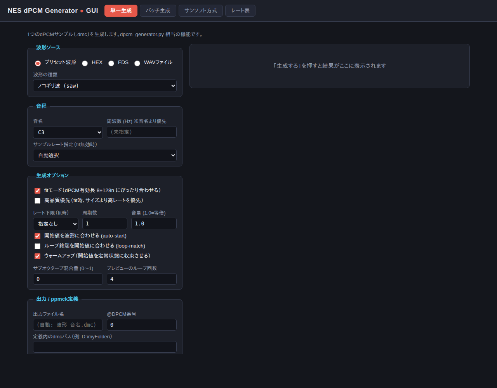
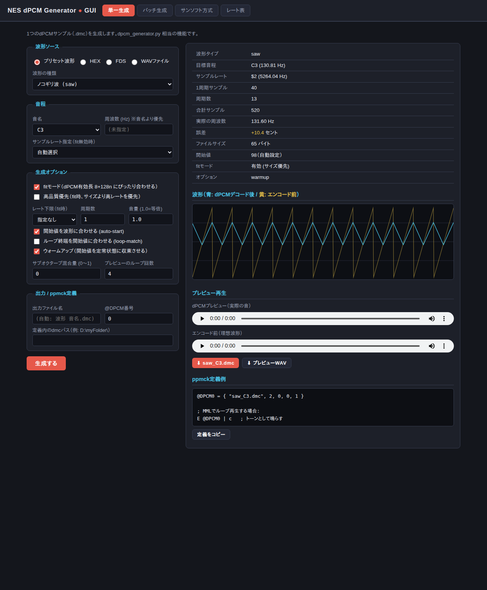
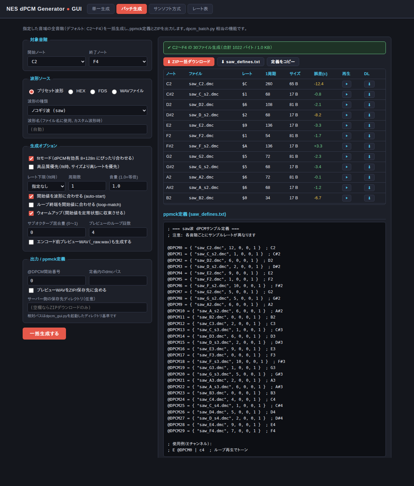
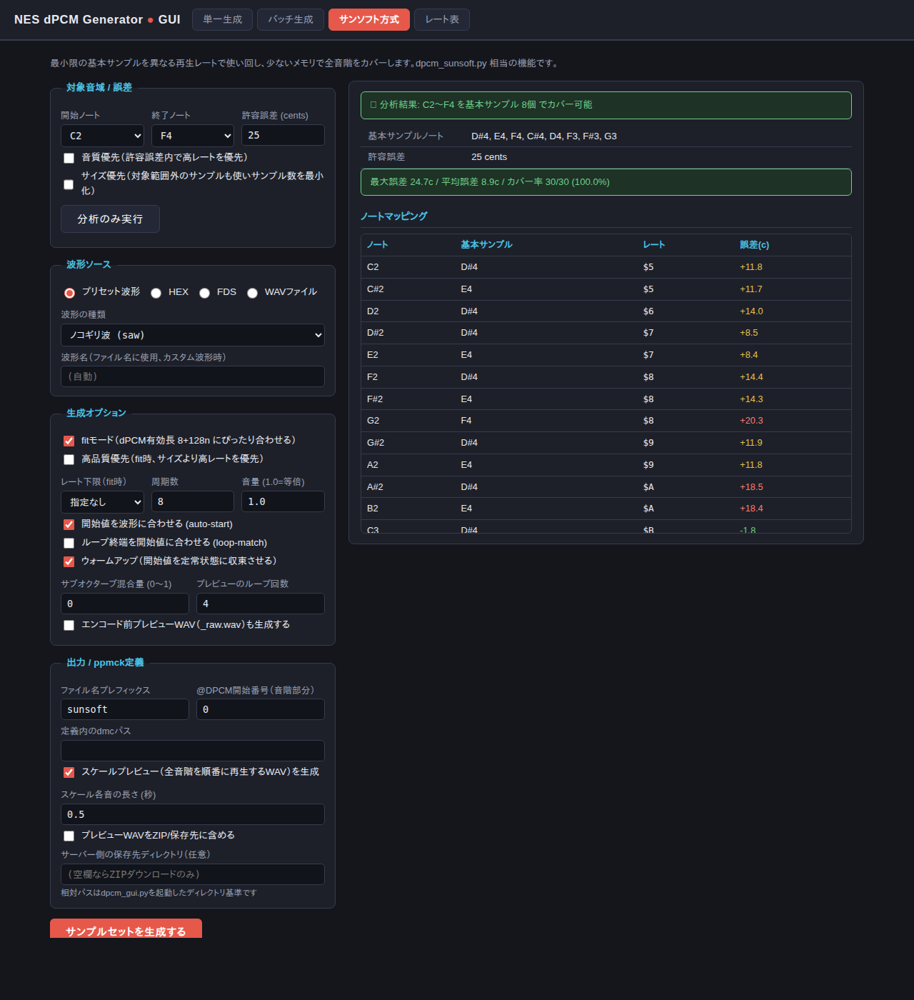
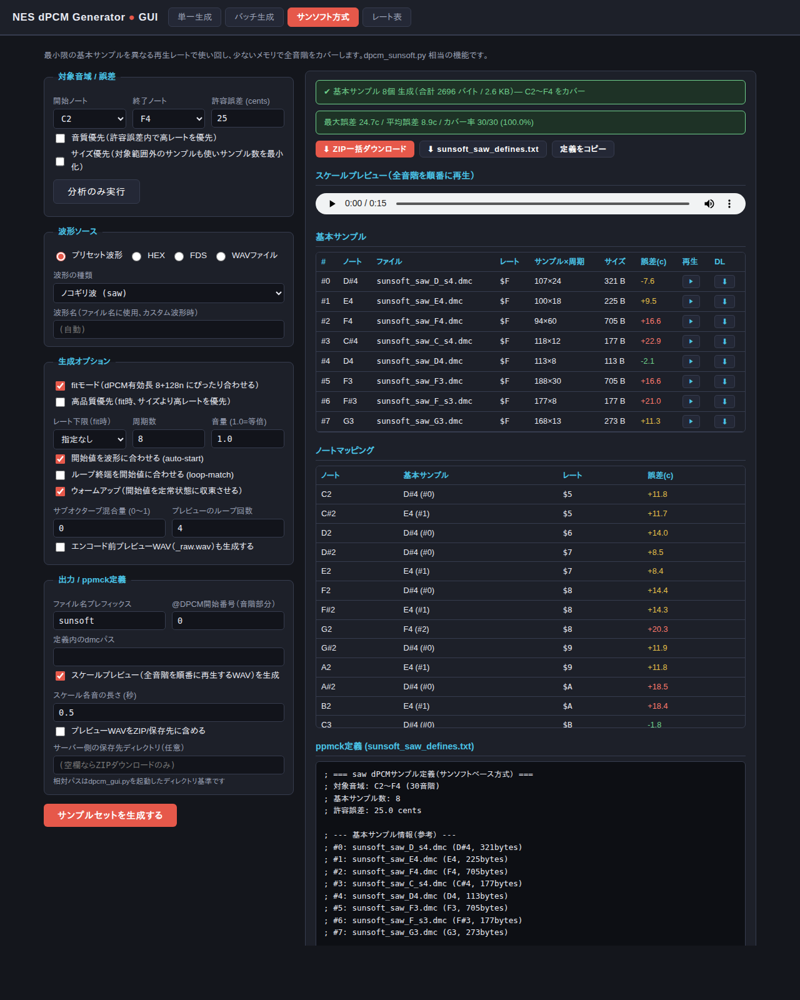

# dPCM Tone Generator — GUIマニュアル

ブラウザから操作できるGUI版の使い方を説明します。コマンドライン操作は不要で、波形の確認・音のプレビュー・ファイルのダウンロードまでブラウザ上で完結します。

## 目次

1. [はじめに](#はじめに)
2. [起動と終了](#起動と終了)
3. [画面の構成](#画面の構成)
4. [共通の設定項目](#共通の設定項目)
5. [単一生成タブ](#単一生成タブ)
6. [バッチ生成タブ](#バッチ生成タブ)
7. [サンソフト方式タブ](#サンソフト方式タブ)
8. [レート表タブ](#レート表タブ)
9. [生成したファイルをppmckで使う](#生成したファイルをppmckで使う)
10. [よくある質問](#よくある質問)

---

## はじめに

このGUIでは、ファミコン（NES）のdPCM音源用サンプル（.dmcファイル）を作成できます。ノコギリ波などの基本波形やWAVファイルから、指定した音程で鳴るループ用サンプルを生成し、その場で試聴できます。

できること：

- **単一生成** — 1つの音程の.dmcファイルを作り、波形グラフと音で確認
- **バッチ生成** — 指定した音域の全音階をまとめて生成し、ZIPでダウンロード
- **サンソフト方式** — 少ないサンプル数で全音階をカバーする省メモリセットの生成
- **ppmck定義の出力** — 生成したサンプルをppmck（MML）で使うための定義テキストを自動作成

## 起動と終了

**必要なもの**: Python 3.8以上（追加ライブラリは不要）と、一般的なWebブラウザ。

ターミナル（コマンドプロンプト）でリポジトリのフォルダに移動し、次を実行します：

```bash
python dpcm_gui.py
```

ローカルサーバーが起動し、ブラウザで `http://127.0.0.1:8765/` が自動的に開きます。

| オプション | 説明 |
|---|---|
| `--port 8000` | ポート番号を変更する（既定: 8765） |
| `--no-browser` | ブラウザを自動で開かない（URLを手動で開く） |

**終了するには**、ターミナルで `Ctrl+C` を押します。

> このサーバーは自分のPC内（127.0.0.1）からのみアクセスできます。外部に公開されることはありません。

## 画面の構成



- **上部のタブ** — 「単一生成」「バッチ生成」「サンソフト方式」「レート表」を切り替えます
- **左側** — 生成条件を設定するフォーム
- **右側** — 生成結果（情報・波形・プレビュー・ダウンロード）が表示されます
- **右上の言語ボタン** — 表示言語を日本語／英語で切り替えます。初回はブラウザの言語を自動判定し、選択はブラウザに記憶されます

## 共通の設定項目

3つの生成タブに共通する項目です。

### 波形ソース

| 選択肢 | 説明 |
|---|---|
| プリセット波形 | ノコギリ波／三角波／サイン波／矩形波／パルス波（25%・12.5%）から選択 |
| HEX | 16進数文字列で波形を直接入力（2文字＝1サンプル、符号付き8bit） |
| FDS | ディスクシステムの波形形式（スペース区切りの0〜63、通常64個） |
| WAVファイル | 1周期分の波形が入ったWAVファイルを読み込み（8/16/24bit PCM対応、ステレオは自動でモノラル化） |

WAVファイル選択時は**ローパスフィルタ**の設定も表示されます。カットオフ周波数を空欄にすると、出力サンプルレートに応じて自動設定されます（エイリアシングノイズの防止）。

### 生成オプション

| 項目 | 既定 | 説明 |
|---|---|---|
| fitモード | ON | サンプル数をdPCMの有効長（8+128n）にぴったり合わせ、パディングによるノイズを排除します。**通常はONのまま**を推奨 |
| 高品質優先 | OFF | fitモードで、ファイルサイズよりサンプルレートの高さを優先（音質向上・サイズ増） |
| レート下限 | 指定なし | fitモードで使用するサンプルレートの下限。「高品質優先ほどではないが音質を確保したい」ときの中間設定 |
| 周期数 | 1 | ファイルに含める波形の繰り返し数。fitモードでは指定値以上で最適な値が自動選択されます |
| 音量 | 1.0 | 波形の振幅。1.0で等倍、0.5で半分。1.0超はクリッピングの可能性あり |
| 開始値を波形に合わせる (auto-start) | ON | 再生開始時の「駆け上がり／降下」ノイズを防ぎます |
| ループ終端を開始値に合わせる (loop-match) | OFF | ファイル終端に補正を加えてループ境界を合わせます。**fitモード＋ウォームアップ使用時は不要**（fitを使わない場合に有効） |
| ウォームアップ | ON | エンコーダの状態が定常化するまで助走させてから出力します。ループ再生の品質が向上するため**ONのまま**を推奨 |
| サブオクターブ混合量 | 0 | 1オクターブ下の音を重ねて低音を補強（0.3で基音の30%） |
| プレビューのループ回数 | 4 | 試聴用WAVの繰り返し回数（.dmcファイル自体には影響しません） |

### 結果表示の見方

- **誤差(c)** — 目標音程からのズレをセント（半音の1/100）で表示します。色は目安：緑＝±5以内（ほぼ正確）／黄＝±15以内（実用範囲）／赤＝それ以上
- **レート** — `$0`〜`$F` の16進数表記。ppmck定義の数値に対応します

## 単一生成タブ

1つの.dmcファイルを生成します。もっとも基本的な使い方です。



**手順**：

1. 波形ソースを選ぶ（まずはプリセットの「ノコギリ波」がおすすめ）
2. 「音程」で音名とオクターブ（C と 3 → C3）を選ぶ。周波数を直接指定したい場合はHz欄に入力（音名より優先）
3. 「生成する」ボタンを押す

**結果の見方**：

- **情報テーブル** — 選ばれたサンプルレート、周期数、実際の周波数と誤差、ファイルサイズなど
- **波形グラフ** — 青線＝dPCMエンコード後（実際に鳴る波形）、黄線＝エンコード前の理想波形。dPCMは1サンプルあたり±2しか動けないため、急峻な波形（ノコギリ波の立ち下がりなど）は青線が追従しきれません。この差がdPCM特有の音色になります
- **プレビュー再生** — 「dPCMプレビュー」が実際の音です。「エンコード前」と聴き比べると、dPCM化による音の変化が分かります
- **ダウンロード** — .dmcファイルのほか、プレビューWAVを2種類（`〜.wav`＝dPCM変換後の実際の音／`〜_raw.wav`＝エンコード前の理想波形）それぞれ保存できます
- **ppmck定義例** — そのままコピーしてMMLファイルに貼り付けられます。「@DPCM番号」「定義内のdmcパス」欄で定義の内容を調整できます

## バッチ生成タブ

指定した音域の全音階（半音刻み）を一括生成します。



**手順**：

1. 「対象音階」で開始ノートと終了ノートを選ぶ（既定: C2〜F4の30音階）
2. 波形とオプションを設定して「一括生成する」を押す

**結果の見方**：

- 一覧表の**▶ボタン**で各ノートをその場で試聴、**⬇ボタン**で個別ダウンロードできます
- **ZIP一括ダウンロード** — 全.dmcファイルとppmck定義（`〜_defines.txt`）をまとめて保存
- **スケールプレビュー** — 生成した音階を低い方から順に鳴らしたWAV。「全音階（半音を含む）」と、♯を除いたドレミファソラシだけを鳴らす「ドレミファソラシ」の2種類があり、音程の正確さを耳で確認できます
- **プレビューWAVをZIP/保存先に含める** — チェックすると試聴用WAV（スケールプレビュー含む）もZIPに入ります
- **サーバー側の保存先ディレクトリ** — PCの指定フォルダへ直接保存したい場合にパスを入力します（空欄ならZIPダウンロードのみ）

> 高い音域ほど1周期あたりのサンプル数が少なくなり音質が粗くなります。また、fitモードで誤差条件を満たせないノートはスキップされ、失敗一覧に表示されます。

## サンソフト方式タブ

**同じ.dmcファイルを異なる再生レートで使い回す**ことで、少ないサンプル数（＝少ないメモリ）で全音階をカバーする方式です。サンソフトのゲームで使われたテクニックに由来します。

まず「**分析のみ実行**」で、必要な基本サンプル数とカバー状況を確認するのがおすすめです：



問題なければ波形を選んで「**サンプルセットを生成する**」を押します：



**設定のポイント**：

- **許容誤差 (cents)** — 音程のズレをどこまで許すか。小さくすると正確になりますが、必要な基本サンプル数が増えます（既定: 25）
- **音質優先** — 許容誤差内でより高い再生レートを選び、音質を優先します
- **サイズ優先** — 対象範囲より高いノートのサンプルも使い、基本サンプル数を最小化します

**結果の見方**：

- **基本サンプル** — 実際に生成された.dmcファイル。試聴・個別ダウンロードできます
- **ノートマッピング** — 「どの音階を、どのサンプルを、どのレートで再生して出すか」の対応表。ppmck定義はこの表に沿って音階ごとに出力されます
- **スケールプレビュー** — 音階を低い方から順に鳴らしたWAV。「全音階（半音を含む）」と「ドレミファソラシ（♯を除く）」の2種類で、音程の正確さを耳で確認できます

## レート表タブ

ファミコンのdPCMで使える16種類のサンプルレート（NTSC）の一覧です。ppmck定義の3番目の数値（`$0`〜`$F`＝0〜15）がこのレートに対応します。

## 生成したファイルをppmckで使う

1. 生成した.dmcファイルをppmckプロジェクトのフォルダに置きます
2. GUIが出力したppmck定義（`@DPCM0 = { "saw_C3.dmc", 2, 0, 0, 1 }` のような行）をMMLファイルに貼り付けます
   - 最後の `1` はループフラグです（トーンとして鳴らすため）
3. EチャンネルでdPCMを鳴らします。Eチャンネルでは音名（cdefgab）ではなく、`n`コマンドで@DPCM番号を直接指定します：

```
E n0   ; @DPCM0がループ再生でトーンとして鳴る
```

ファイルの置き場所に合わせて「定義内のdmcパス」欄を設定すると、定義のパス部分を調整できます。

## よくある質問

**Q. サンソフト方式で「カバーできないノート」エラーが出る**
表示されたノートが、現在の「許容誤差 (cents)」ではdPCMの制約（16種類の固定サンプルレートと有効サンプル長）内に収まらないことを意味します。範囲内にそのノートが含まれる限り、開始ノートを変えても同じエラーになります（選択が効いていないわけではありません）。許容誤差を大きくするか、終了ノートを下げてください（目安: 既定の25centsではC5あたりが上限です）。

**Q. 起動時に「Address already in use」と表示される**
そのポートが既に使われています。`python dpcm_gui.py --port 8000` のように別のポートを指定してください。

**Q. ブラウザが自動で開かない**
環境によっては自動起動できないことがあります。表示されるURL（例: `http://127.0.0.1:8765/`）をブラウザに直接入力してください。
また、直近までGUIタブが開かれていた状態でサーバーを再起動した場合は、タブが二重に開くのを防ぐため自動起動を意図的にスキップします（その旨のメッセージが表示されます）。開いていたタブをそのまま利用するか、閉じてしまった場合はURLを直接開いてください。

**Q. ▶ボタンを押しても音が鳴らない**
ブラウザの自動再生制限が原因のことがあります。ページ内を一度クリックしてから再度試すか、`<audio>`プレーヤーの再生ボタンを使ってください。PCの音量・ミュート設定もご確認ください。

**Q. WAVファイルが読み込めない**
対応形式は8/16/24bitのPCM（無圧縮）WAVです。32bit floatやMP3等は非対応です。また、**1周期分だけを切り出した**WAVを使うと意図通りの音程になります。

**Q. 「適切なパラメータが見つかりませんでした」と表示される**
fitモードで誤差条件を満たす組み合わせがない状態です。周期数を減らす、レート下限を下げる（または「指定なし」にする）、音程を変えるなどを試してください。

**Q. 生成した音の音程が微妙にずれている**
dPCMのサンプルレートは16種類しかないため、多くの音程で数セントの誤差が生じます。誤差表示が±5セント（緑）ならほとんど聴き分けられません。fitモードは誤差15セント以内を目標に探索します。

**Q. 「サーバー側の保存先ディレクトリ」に相対パスを入れたらどこに保存される？**
`dpcm_gui.py` を起動したディレクトリが基準になります。迷う場合は絶対パス（例: `C:\music\dpcm` や `/home/user/dpcm`）を指定してください。

**Q. 波形グラフの青線が黄線から大きくズレている**
dPCMは1サンプルごとに±2しか値を動かせないため、急な変化に追従できないのは正常な動作です。気になる場合は「高品質優先」やレート下限の指定でサンプルレートを上げると追従性が改善します（ファイルサイズは増えます）。
